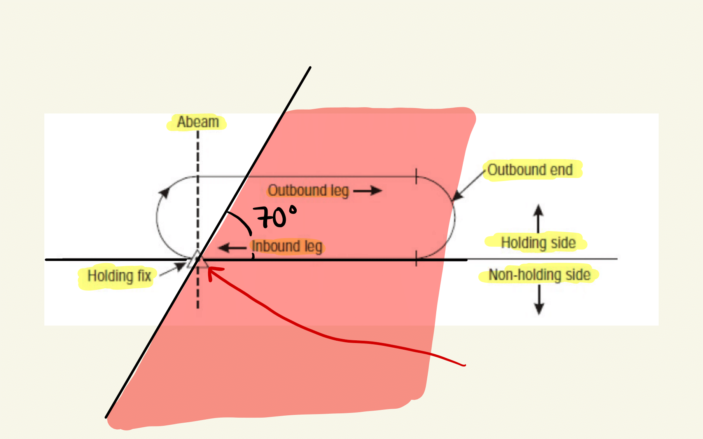
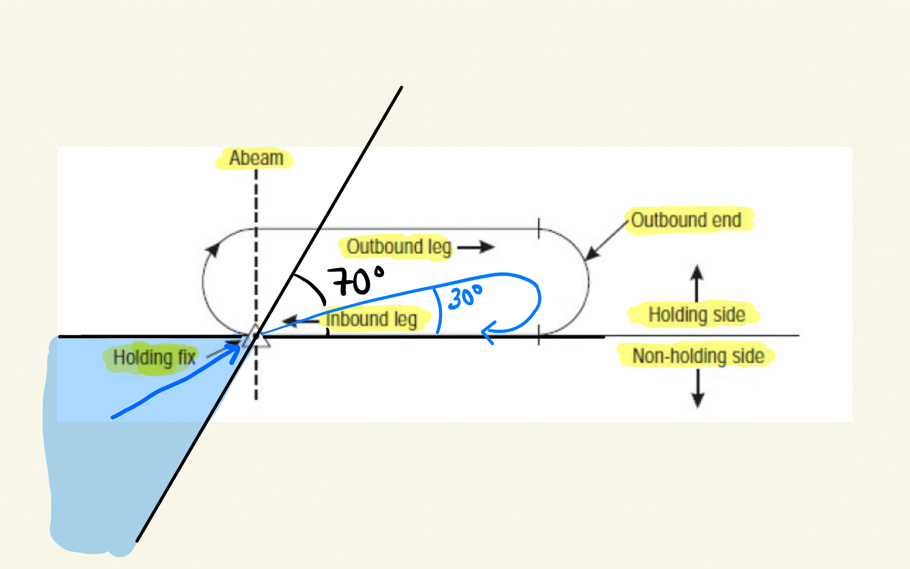
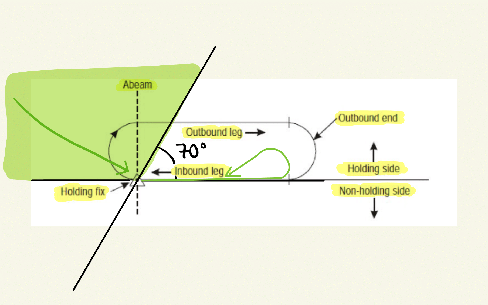
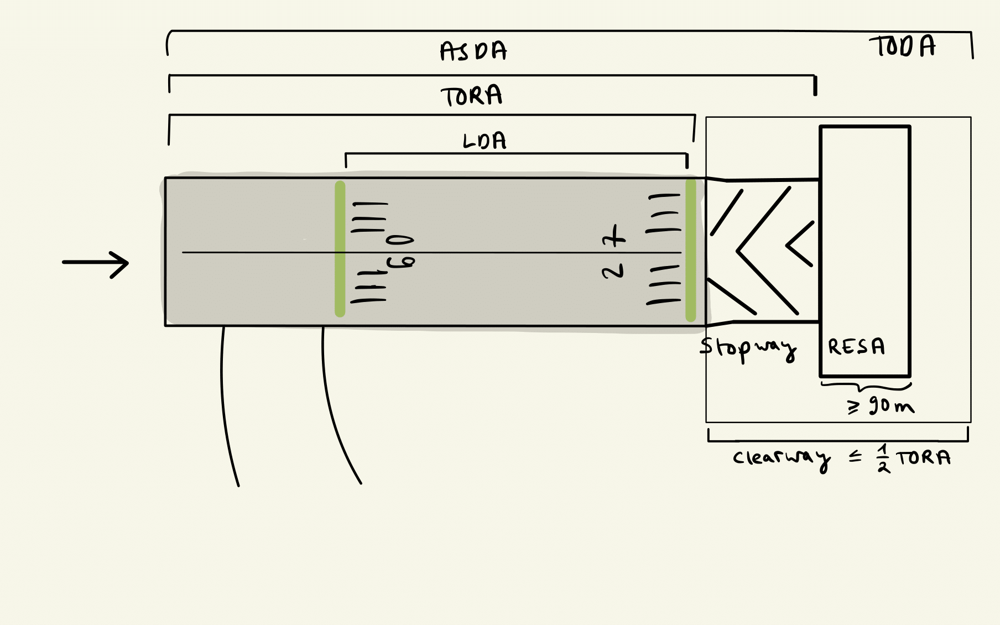
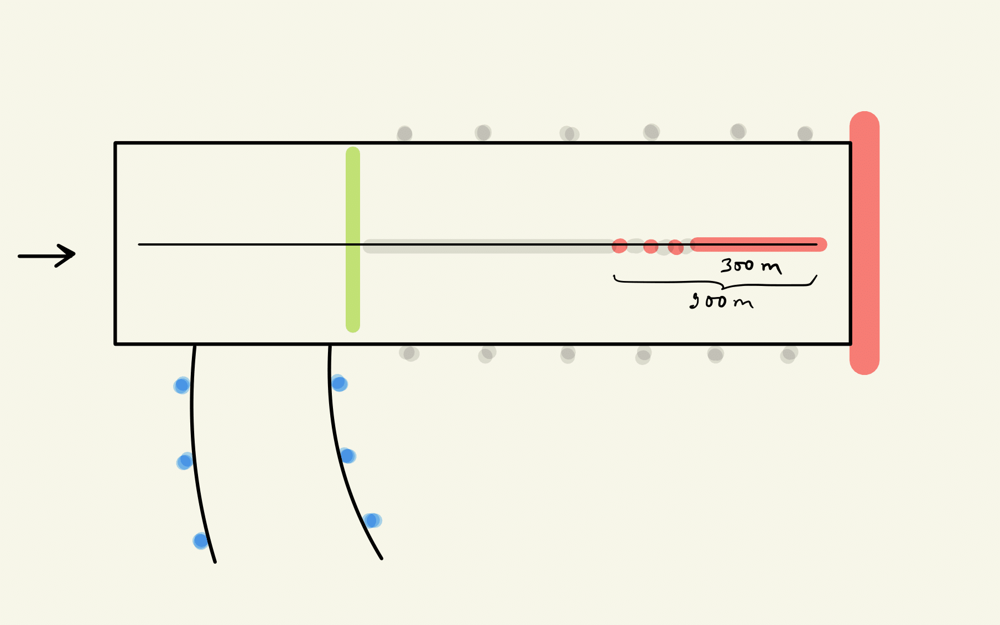
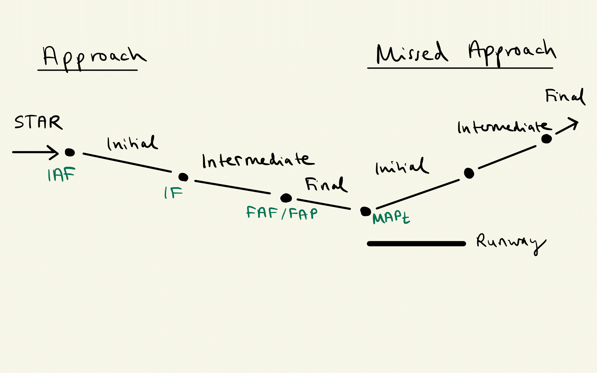

```{r, include = FALSE}
knitr::opts_chunk$set(
  fig.align = "center",
  echo = FALSE,
  out.width="70%"
)
```

# `r emo::ji("police_officer")` Air Law {#air-law}

## Licensing

You need a license to fly as a crew member in any aircraft. The start is usually the private pilot license (PPL). If you want to get paid for flying, you need a commercial pilot license (CPL). Furthermore, you need so-called ratings for certain privileges or for flying special aircraft types. For example, you an instrument rating is required for flying in bad weather. All the rules for obtaining a license or rating and for revalidation are stated by [part flight crew licensing (FCL) of EU regulation 1178](https://part-aero.com/#part-fcl).

## Rules of the air

Another EU regulation numbered 923 formulates [standardized european rules of the air](https://www.easa.europa.eu/regulations/sera-standardised-european-rules-air) (short SERA). I list some of them below.

### Controlled flights

### Visual flight rules

### Instrument flight rules

RVSM airspace vertical separations:

> Add image.

- < FL 290: 1000 ft 
- FL 290 - FL 410
  - in RVSM: 1000 ft
  - else: 2000 ft (standard)
- > FL 410: 2000 ft

Semi-circular rules:

> Add image.

0 - 179 degree magnetic: ODD
180 - 359 degree magnetic: EVEN

Minimum flight level:

- 600 m (2000 ft) above highest obstacle within 8 km in mountainous areas
- elsewhere 300 m (1000 ft)

### Position reports

- Aircraft ident
- Position
- Time
- Altitude
- Next position
- Ensuing point

Memory rule: APTANE (all pilot take aircraft navigation exams)

### Communication failure

- VFR: Squawk 7600 and land at nearest suitable airport
- IFR in VMC: Continue VFR and land directly
- IFR in IMC: Follow flight plan and land within 30 minutes of ETA
  - no radar: last assigned speed / level for 20 minutes
  - radar: last assigned speed / level for 7 minutes
  
In an emergency, Transponder mode A, Squawk 7700

### Holding procedures

Turns: right (standard)

Outbound time:
- below 14.000 ft: 1min
- above 14.000 ft: 1,5 min

25 degree bank or 3 degree per second (whichever is less)

Buffer area: 5NM

Entry procedures (5 degrees flexibility on each side):

```{r, fig.cap="Direct holding entry."}

```

```{r, fig.cap="Teardrop holding entry."}

```

```{r, fig.cap="Parallel holding entry."}

```

Memory rule: The name of the holding procedure describes the flight path after the holding fix.

Minimum permissible holding height: 300 m obstc. clearance

Shuttle: climb / descend in holding

adapt timing (tail/headwind) and heading (wind correction angle) to maintain the track

### Altimeter settings

> Add image of Transition level / layer / altitude

Transition altitude not less than 3000 ft AGL

Calculated height of transition altitude rounded up to next full 1000 ft

Calculate transition level from transition altitude (will be passed to aircraft by ATS):
TA: 3000 ft, QNH: 990 hPa, (1013 hPa - 990 hPa) * 30 ft/hPa = 660 ft, hence if changing the altimeter reference at 3000 ft to standard pressure would have 3660 ft altitude, hence TL is 4000 ft = FL 40.

Transition altitudes are published in AIPs or SIDs

## Air traffic management

2D separation: horizontal and vertical

Longitudinal separation minima:

- on track: 5 (3) min if proceeding aircraft is 20 kts (40kts) faster
- departure: 3 min if proceeding aircraft is 40 kts faster
- levels crossed: 15 min (default), 10 min (regular fixes), 5 min (absolute minimum)
- on same NDB: more than 30 degrees at distance greater than 15 NM from facility
- same VOR: more than 15 degrees at distance greater than 15 NM from facility
- DME: 20 NM (10NM if 20 kts faster)

clearance to land: at the latest 2 NM from touchdown

no more speed control: 4 NM or less from touchdown

report significant wind changes:
- head: 10kts
- cross: 5kts
- tail: 2 kts

## AIP

GEN: Services, Sigmet, S and R, location indicators, fees, local regulations
ENR: communication failures, runway signals, holding/approach/departure procedures
AD: fueling, meterological information, runway lightning 

## Aeronautical information service AIS

- Movement area: manoeuvring area, aprons, maintenance stands
- apron: load and unload, parking, refueling, maintenance
- airside:

AIRAC: Advanced!

### Transponder

- Std Squawk: 
  - IFR: 2000
  - VFR: 7000
  - unop: 0000
  
Transponder failure before dep.: Permission to proceed to nearest suitable airport for repair.

### Operations on two parallel runways:

- segregate: one only departures, one only approaches
- semi-mixed: one both, one only one
- mixed: both on both
- progressive: does not exist

## Air Traffic Service ATS

| Class | Type  | Separation |  Service | Speed Limit | Radio | Clearance |
| ----- | ----- | ---------- | -------- | ----------- | ----- | --------- | 
| A     | IFR   | from all   | ATC      |             |       |           |     
| B     | IFR   | from all   | ATC      |             |       |           | 
|       | VFR   | from all   | ATC      |             |       |           | 
| C     | IFR   | from all   | ATC      |             |       |           |
|       | VFR   | from IFR   | ATC      | yes*        |       |           |
| D     | IFR   | from IFR   | ATC      | yes*        |       |           |
|       | VFR   |            | FIS      | yes*        |       |           |
| E     | IFR   | from IFR   | ATC      | yes*        |       |           | 
|       | VFR   |            | FIS      | yes*        | no    | no        | 
| F     | IFR   | from IFR   | FIS      | yes*        |       | no        | 
|       | VFR   |            | FIS      | yes*        | no    | no        | 
| G     | IFR   |            | FIS      | yes*        |       | no        | 
|       | VFR   |            | FIS      | yes*        | no    | no        | 

*Speed Limit: Below 10000ft AMSL is 250 kt IAS.

## Aerodroms

### Runway

TODA: Take-off distance avaiable (TORA + clearway)
TORA: Take-off run available
ASDA: Accelerated stop distance available (TORA + stopway)
RESA: Runway end safety area (at the end of the runway strip)
LDA: Landing distance available 

```{r, fig.cap="Runway zones."}

```

### Lightning

```{r, fig.cap="Runway lights."}

```

### Signs

Mandatory instructions: White inscription on red background

C: Visiting pilots should report

Location signs: Yellow writing on black background

### Approach aids

PAPI

APAPI

Approach lighting system: Simple (SALS) and precision (PALS)

Number of runway stripes: round up runway width / 4


## Aircraft operations

### Departure 

Obstacle clearance method for departures with no track guidance:

- omni-directional: restricted sectors specified by bearings and distances

- straight (< 15 degree deviation from extended runway): track guidance within 20km

- turn (> 15 degree): guidance within 10km

Minimum obstacle clearance: 0.8% of horizontal distance in straight departures

Procedure design gradient: 2.5% (at least) + 0,8% (additional margin) = 3,3%

### Approach

The approach consists of the following segments:

- arrival

- initial

- intermediate (ends at the FAF/FAP, the FAP is at a maximum (minimum, optimum) of 10 (3, 5) NM from threshold)

- final

- missed approach, which is separated again in three segments:

  - initial 
  
  - intermediate (ends where 50m obstacle clearance is obtained and can be maintained)
  
  - final

```{r, fig.cap="Approach segments.", }

```

Optimum glide path 3 degree / 5 percent

MOC:
- initial: 300m (1000 ft)
- intermediate: 150m (500 ft)
- final: 90m (300ft) without FAF and 75m (250ft) with FAF

OCA/H: Obstacle clearance altitude/height
DA/H: decision altitude/height = OCA/H + margin
MDA/H: for non-precision: Minimum descend A/H = OCA/H + margin

Aircraft categories based on $V_{AT}$ (IAS at threshold): ...

Circling approach.