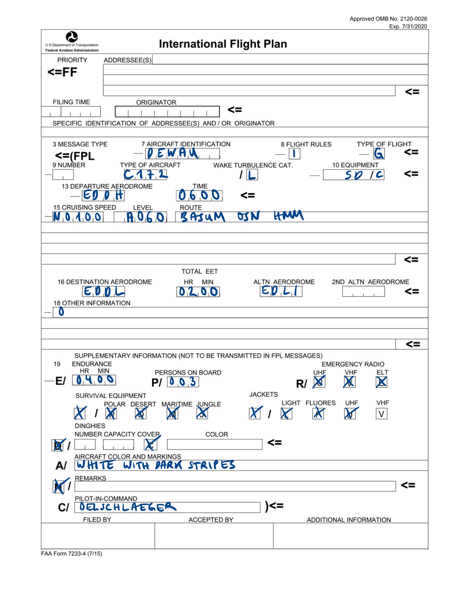

```{r, include = FALSE}
knitr::opts_chunk$set(
  fig.align = "center",
  echo = FALSE,
  out.width="70%"
)
```

# `r emo::ji("calendar")` Flight Planning {#flight-planning}

## Flight plan

Filing a flight plan - for some flights you have to (IFR flights, international flights), for all flights you can (to facilitate SAR operations). A flight plan is a standardized sheet of information on an intended flight provided to air traffic control, see [SERA.4001](https://part-aero.com/#part-sera/SERA.4001). They can be submitted [online](https://ais.dfs.de/), via telephone, or even in-flight via radio. A plan should be closed on a safe arrival.

Let's do an example. Say we fly under instrument flight rules [from Hamburg to Duesseldorf](https://skyvector.com/?ll=52.464934810772675,8.731933596304598&chart=304&zoom=3&fpl=N0100A060%20EDDH%20BASUM%20OSN%20HMM%20EDDL) in a Cessna 172. A flight plan could look like follows:

```{r}

```

### Item 7: Aircraft identification

Either the registration or a company callsign.

### Item 8: Flight rules, Type of flight

The flight rule goes into the first part of box 8 and can be I (IFR), V (VFR), Y (IFR changes to VFR), Z (VFR changes to IFR). Next comes the type of flight, which can be S (scheduled), N (non-scheduled), G (general aviation), M (military), X (others).

### Item 9: Number and type of aircraft, Wake turbulence category

Here you would insert the number (greater than one) of aircraft if you fly in a formation. Next the [ICAO code for the aircraft type](https://en.wikipedia.org/wiki/List_of_aircraft_type_designators), and then the wake turbulence category: H for heavy (), M for medium (), and L for light () based on the maximum certified takeoff mass.

### Item 10: Equipment

Letters indicating the communication, navigation, and transponder equipment. There are many options: N for none, S for standard equipment (VHF, ADF, VOR, ILS), D for DME, C for mode C transponder, etc.

### Item 13: Departure aerodrome, Departure time

Use the [aerodrome ICAO code](https://en.wikipedia.org/wiki/ICAO_airport_code) or ZZZZ (with an entry in item 18) if there is none. The departure time is the anticipated (estimated) off-block time EOTB in hours and minutes UTC.

### Item 15: Cruise Speed, Cruising level, Route

Box 15 is the planned initial cruise TAS with the prefix N for knots, M for mach number, and K for kilometers per hour. For the cruising level, either A for altitude in hundreds of feet ASL or F for flight level. Under Route, include speed and altitude changes, airway numbers and waypoints on the route. You can use DCT for a direct route.

### Item 16: Destination aerodrome, Flight time, Alternate (and second alternate) aerodrome

As for item 13, use the ICAO code for the destination and alternate aerodrome. The EET (for Estimated Elapsed Time) is from takeoff to the IAF.

### Item 18: Other information

Use 0 if there is nothing to add. RMK/ means remarks. Critical life (STS/MEDEVAC), transport to hospital (STS/HOSP).

### Supplementary information

The hours and minutes of fuel endurance go into box 19. You can use TBN if you don't know the number of passengers yet. Cross out every emergency and survival equipment that you don't have. Finally, include your name and license number, and the person to be notified if SAR is initiated.


